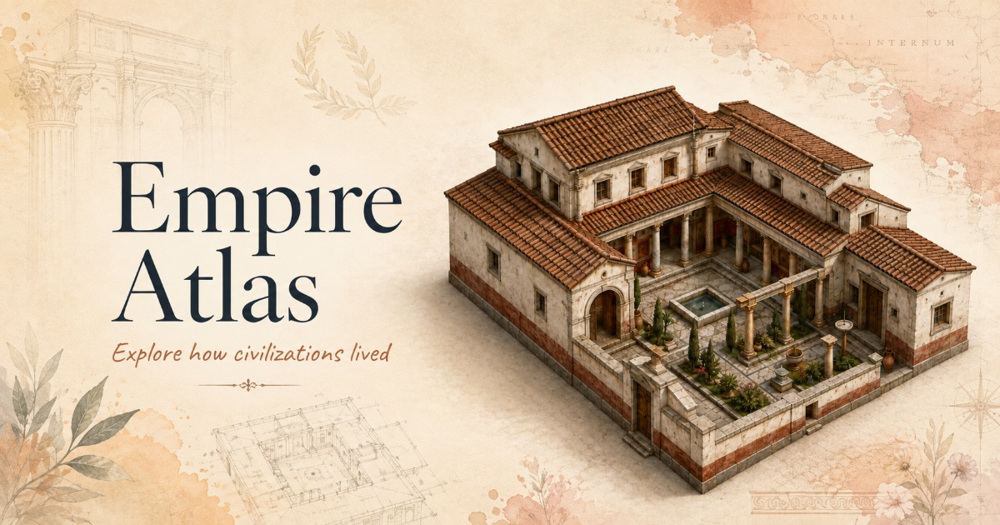

# The 3D Bible

**Ontdek de bouwwerken van de Schrift.** An interactive 3D encyclopedia of biblical architecture,
with content in both Dutch (Statenvertaling) and English (KJV). Turn each structure on its plinth,
read the features pinned to its stonework, and follow the building through its rooms, its objects
and its geography.



---

## Contents

- [What it is](#what-it-is)
- [The structures](#the-structures)
- [Running it](#running-it)
- [How it is put together](#how-it-is-put-together)
- [Adding a structure](#adding-a-structure)
- [Dev tools](#dev-tools)
- [Notes on the 3D viewer](#notes-on-the-3d-viewer)
- [Deploying](#deploying)
- [Accessibility](#accessibility)

---

## What it is

Twelve biblical structures, each modelled in 3D and annotated with the architectural features
described in Scripture. The viewer is the centre of the app: a turntable stage lit like a museum
vitrine, where a structure can be orbited, zoomed, sectioned and read. Content is authored twice,
once per locale — Dutch quotes the Statenvertaling, English quotes the King James Version — and a
structure's text, quiz and timeline switch language without reloading the model.

**What you can do**

|                           |                                                                                                                         |
| ------------------------- | ----------------------------------------------------------------------------------------------------------------------- |
| **Turn the structure**    | Orbit, pan and zoom the model, or drive it from the keyboard (arrows, `+`/`-`, `Home`)                                   |
| **Read its architecture** | Hotspot pins fixed to the geometry itself; hover one for its annotation, click to push the camera in                    |
| **See inside**            | Several structures carry a separate interior/cutaway model, toggled from the same viewer                                |
| **Go deeper**             | Interior views, floor plans, artefacts, daily life and the structure's geography                                        |
| **Learn and test**        | A written lesson per structure, a timeline, and a quiz                                                                  |
| **Search everything**     | `⌘K` finds structures and individual architectural features                                                             |

---

## The structures

Registered in [`src/data/structures/nl/index.ts`](src/data/structures/nl/index.ts) and
[`src/data/structures/en/index.ts`](src/data/structures/en/index.ts), in the order events occur in
Scripture — creation and the fall, through the patriarchs, the exodus and conquest, the kingdom and
exile, the life of Christ, and finally the future city of Revelation:

| Structure (`id`)                | Period                        |
| -------------------------------- | ------------------------------ |
| `eden_fall` — The Garden of Eden | The Creation Week (default landing structure) |
| `noahs_ark` — Noah's Ark          | Before the Flood               |
| `tower_babel` — Tower of Babel    | After the Flood                |
| `parting_sea` — The Parting of the Red Sea | The Exodus            |
| `tabernacle` — The Tabernacle of Moses | Exodus                    |
| `walls_jericho` — Walls of Jericho | Conquest of Canaan            |
| `solomon_temple` — Solomon's Temple | Reign of Solomon             |
| `ezekiel_temple` — Ezekiel's Temple Vision | Babylonian Captivity  |
| `herods_temple` — The Second Temple | Time of Christ (1st century) |
| `mount_of_olives` — The Mount of Olives | Life of Christ            |
| `golgotha` — Golgotha             | The Crucifixion                |
| `new_jerusalem` — The New Jerusalem | Revelation                   |

Adding a thirteenth means adding a data file and its assets. The viewer and the UI are entirely
data-driven and need no code changes — see [Adding a structure](#adding-a-structure) below.

---

## How it was made

The project started as an AI-generated build (application code with **Kimi K3**, 3D models with
**[Tripo AI](https://studio.tripo3d.com/?utm_source=brand&utm_medium=creator&utm_campaign=suj)**,
illustrations with **GPT Image 2.0**) and has since been extended and corrected by hand across many
sessions — new structures, model replacements, hotspot fixes, locale content, bug fixes. Treat any
single-source "made with X" story as the starting point, not the current state of the whole repo.

---

## Running it

Requires Node 20 or newer.

```bash
npm install
npm run dev        # dev server on :3000/the3d-bible/
npm run build      # typecheck (tsc -b), asset checks, then production build to dist/
npm run preview    # serve the production build
npm run lint
```

`npm run build` runs `tsc -b` first, so a type error fails the build rather than shipping. It then
runs [`tools/check-css-classes.mjs`](tools/check-css-classes.mjs) and
[`tools/check-mobile-models.mjs`](tools/check-mobile-models.mjs) — see [Dev tools](#dev-tools).

---

## How it is put together

```
src/
├─ App.tsx                    app shell: layout, locale state, routing of modals
├─ i18n/
│  ├─ locale.tsx               locale context/provider (nl default, en available)
│  └─ strings.ts                UI copy per locale (not structure content — see data/)
├─ three/
│  └─ engine.ts                the entire 3D viewer — renderer, lighting, camera, transitions,
│                              hotspot resolution, model residency, texture/material handling
├─ components/
│  ├─ Viewer.tsx               canvas host, tool rail, layer menu, request sequencing
│  ├─ HotspotLayer.tsx         screen-space pins and their hover annotations
│  ├─ StructureLibrary.tsx     the structure rail (desktop) and drawer contents (mobile)
│  ├─ InfoPanel.tsx            selected-structure detail, in a rail or in the page flow
│  ├─ BottomCards.tsx          the exploration cards (interior, floor plan, artefacts, ...)
│  ├─ Banner.tsx               dismissible attribution bar
│  ├─ DescriptionText.tsx      renders a structure's description with its inline links
│  ├─ modals.tsx               lesson, quiz, artefacts, timeline, sections, ⌘K search
│  └─ ui/                      shadcn/ui primitives
├─ data/
│  ├─ index.ts                 structuresFor(locale), structureById(locale, id) lookups
│  └─ structures/
│     ├─ nl/*.ts                one file per structure: Dutch copy (Statenvertaling), hotspots,
│     │  index.ts               lesson, quiz, timeline; index.ts registers the STRUCTURES_NL array
│     └─ en/*.ts                the same structures in English (KJV); index.ts registers STRUCTURES_EN
└─ types/structure.ts          the data contract every structure file satisfies
```

**Stack** — React 19 · TypeScript 5.9 · Vite 7 · Tailwind CSS 3.4 · three.js 0.185 (WebGPU renderer
with TSL node materials, `forceWebGL` compatibility mode) · GSAP 3 · three-mesh-bvh · shadcn/ui

**Design language** — a warm parchment palette on Cormorant Garamond and Inter, defined once as CSS
custom properties in [`src/index.css`](src/index.css) and bridged into Tailwind and shadcn tokens.

**Responsive behaviour** — the three-column desktop stage engages at 1280px. Below that the structure
library moves into a drawer behind a hamburger, the structure detail reads inline beneath the model,
and the exploration cards step down in column count.

---

## Adding a structure

There is no router and no ID whitelist beyond the two index files — registering a structure there is
the entire integration surface; the library card, search index, quiz and timeline are all
data-driven from it.

1. Write `src/data/structures/nl/<id>.ts` and `src/data/structures/en/<id>.ts`, each exporting a
   `Structure` object (see [`src/types/structure.ts`](src/types/structure.ts) for every field).
   Dutch content quotes the Statenvertaling; English quotes the KJV.
2. Add the import and the export to both `src/data/structures/{nl,en}/index.ts` arrays, in
   Scripture-chronological order.
3. Drop the model at `public/models/<id>.glb` (plus `<id>_inside.glb` for a cutaway variant, if any),
   and the mandatory image set at `public/img/<id>/thumbnail.webp` + `hero.webp`, plus whatever
   section images the data file references.
4. Author each hotspot's `anchor` by eye, then run `node tools/audit-hotspots.cjs` — it flags any
   anchor that lands over empty space or on the wrong surface. See [Dev tools](#dev-tools).
5. `npm run build` — the mobile-model and CSS-class checks run automatically and will fail the build
   if an asset or class is missing.

---

## Dev tools

[`tools/`](tools/) holds two kinds of script: two run automatically as part of `npm run build`
(asset/class checks), and three are manual, run by hand while authoring hotspots or inspecting a
model. None of them touch data unless told to.

| Script | Run it when… | What it does |
| ------ | ------------- | ------------- |
| `check-css-classes.mjs` *(auto, in `build`)* | always, on build | fails the build if a Tailwind class referenced in code doesn't resolve |
| `check-mobile-models.mjs` *(auto, in `build`)* | always, on build | fails the build if a structure is missing its compressed `public/models/mobile/` variant |
| `audit-hotspots.cjs` | after changing a model or adding a structure | loads every structure's GLB(s), builds a height field, and reports hotspots that float over empty space, sit too low for their `snap`, or are far from the surface they should land on |
| `analyze-model.cjs <model.glb>` | figuring out where a feature actually is in an unlabelled mesh | prints a top-down ASCII height map, or (`--front`/`--side`) a facade view, or (`--protrude y0 y1`) a profile that picks out pillars/jambs standing proud of a wall |
| `fix-anchors.cjs <structure> <id>=x,y,z[=snap] ...` | applying a verified anchor correction | rewrites the named hotspot's `anchor` (and `snap`, if given) in **both** `nl` and `en` files at once, so the two locales can never drift apart |

`audit-hotspots.cjs` and `analyze-model.cjs` need `@gltf-transform/core`, `@gltf-transform/extensions`
and `draco3dgltf` (already in `devDependencies`) — they read the published, Draco-compressed GLBs
directly, the same files the browser loads.

**In-browser anchor picker** — open the dev server with `?dev=1` (e.g.
`localhost:3000/the3d-bible/?dev=1`) and a coordinate overlay appears
([`src/dev/DevHotspotEditor.tsx`](src/dev/DevHotspotEditor.tsx)). It lists every hotspot already
placed on the current structure, and clicking anywhere on the model reads off that point's normalised
anchor — the exact triple `hotspots[].anchor` takes — so a spot can be pointed at instead of guessed.
This is the fastest way to find where an unlabelled figure or feature actually sits in a dense,
single-mesh export (Tripo/Meshy exports arrive with no per-part names, so nothing but geometry says
"this is Eve" or "this is the altar"). Read-only; gated to dev builds, never ships to production.

---

## Notes on the 3D viewer

A few decisions in [`src/three/engine.ts`](src/three/engine.ts) that are not obvious from the code:

**Hotspots resolve against the geometry, not against fixed coordinates.** Authoring a pin as a fixed
point in the model's bounding box puts it in mid-air as often as on the building. Instead each
hotspot declares what kind of surface it belongs on (`roof`, `court`, `wall`, or `none` for an exact
spot), and the engine samples a top-surface height field over the footprint to find it. `none` skips
the search entirely and trusts the authored anchor — required for any structure raycast through a
coarse proxy (see next point), since the proxy can't resolve a real roof/court search.

**Two structures raycast against a coarse invisible proxy instead of their real geometry**
(`RAYCAST_PROXY_STRUCTURES` in `engine.ts`) — `eden_fall` and `solomon_temple`, both dense enough
(millions of triangles in one mesh) that building a BVH over the real mesh would block the main
thread for seconds. Every hotspot on a proxied structure must use `snap: "none"`.

**Loading a heavy model can legitimately take real seconds**, not just for the download but for
compiling its shaders and uploading a large embedded texture (`warm()` in `engine.ts`). That warm-up
is capped at `WARM_TIMEOUT_MS` as a safety net against a pathological multi-minute stall, but the cap
is set high enough that an ordinary heavy load — hundreds of thousands of triangles, a 4K texture —
finishes properly warmed rather than appearing textureless for a few seconds. If a structure ever
looks flat white/untextured right after it appears, that is very likely this: give it a few more
seconds before assuming something broke.

**The stage backdrop is CSS, not scene geometry.** The canvas is transparent. A rendered parchment
gradient would be run through ACES tone mapping and come out grey, so the backdrop is painted in CSS
behind the canvas and keeps the exact palette of the surrounding UI.

**Switching structures is a turntable spin.** The structure on stage spins up about its own axis and,
at the point where it is turning fastest, the next one takes over the same rotation and carries it to
rest.

**Recently seen structures stay resident**, and hovering a structure in the library begins fetching
it in the background — but that background preload is deferred to `requestIdleCallback` so it can
never steal the main thread from a load the user actually clicked for.

---

## Deploying

Two paths exist, for two different hosts:

**GitHub Pages** — [`.github/workflows/deploy-pages.yml`](.github/workflows/deploy-pages.yml) builds
and publishes automatically on every push to `main`, resolving Git LFS models to their real binary
content first (Actions' artifact upload has no per-file size cap, unlike a normal git push, which is
why the large `.glb` files are tracked via LFS). Live at the repo's Pages URL, base path
`/the3d-bible/`.

**Manual upload to desamenkomst.nl** — the site is also meant to live as a page inside "de
samenkomst." [`.github/workflows/build-upload.yml`](.github/workflows/build-upload.yml) builds the
same site with relative asset paths (`VITE_BASE: ./`, so it works from any subfolder on any host) and
attaches it as a downloadable `3D-Bible` artifact on every push. Get it from the GitHub repo's
**Actions** tab → the latest **"Build upload-ready site"** run → the `3D-Bible` artifact at the
bottom of the run page, and upload its unzipped *contents* (not the zip, and not the folder itself —
upload what's inside it) to the target folder on the host, or every asset path ends up nested one
level too deep and 404s.

To build the same thing locally instead of waiting on Actions:

```bash
rm -rf upload-naar-server
VITE_BASE=./ npm run build
mv dist upload-naar-server
```

`upload-naar-server/` is gitignored — it's a local staging folder, not something to commit. Upload
its *contents*, same rule as above.

`og:image` and `og:url` in [`index.html`](index.html) should be absolute URLs once the site has a
final domain — most crawlers resolve a relative path against the page, but not all do.

---

## Accessibility

- Full keyboard control of the viewer, and hotspot pins are focusable buttons whose annotation opens
  on focus as well as hover
- `prefers-reduced-motion` is honoured and tracked live: transitions resolve instantly, and the pin
  and loading animations stop
- Semantic landmarks, labelled controls, `aria-pressed`/`aria-expanded` on toggles, and live regions
  on loading state
- Focus rings are never removed, only restyled
